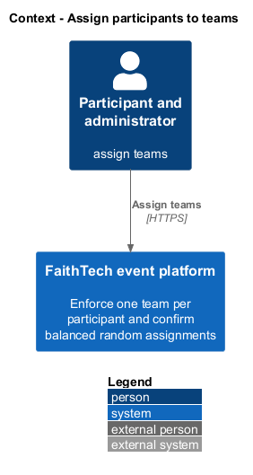
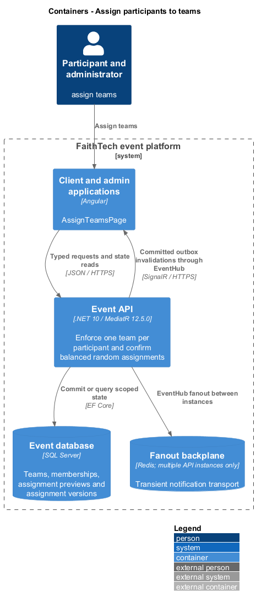
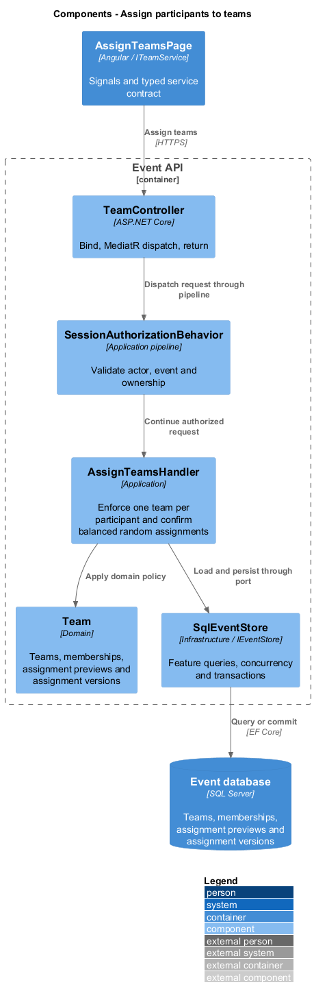
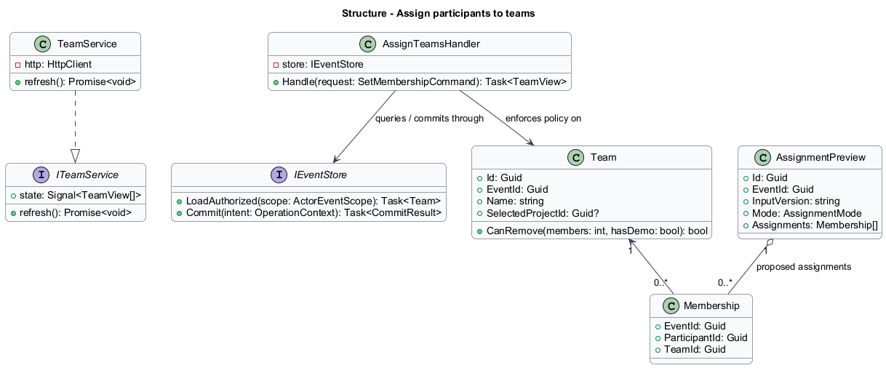
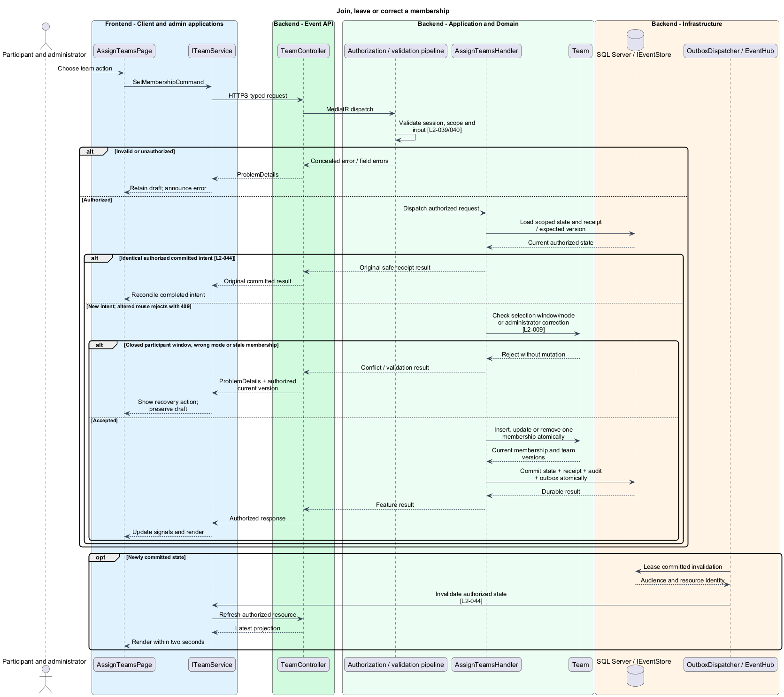
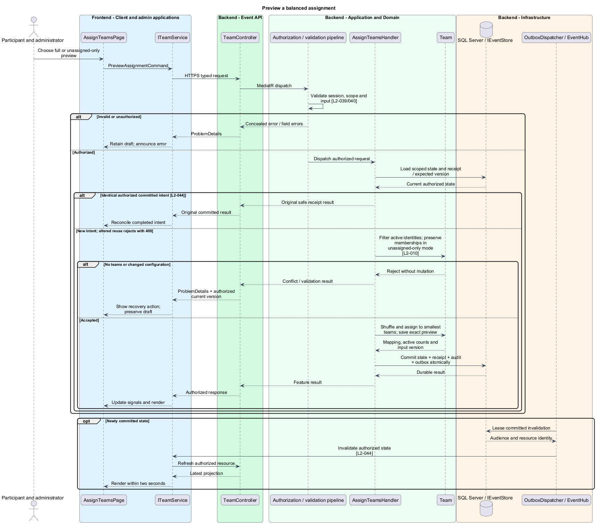
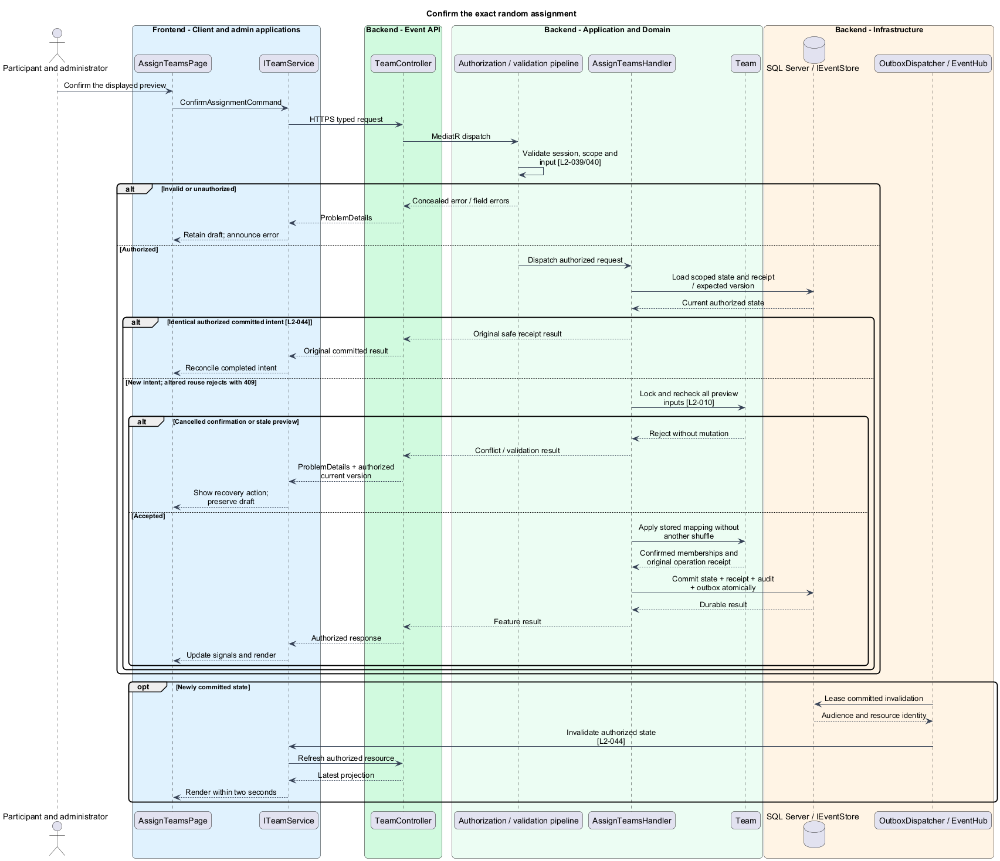

# Assign participants to teams

## Overview

A team groups participants within one event and owns a selected project. Self-selection lets participants join, leave, or switch during the selection window. Random assignment is an administrator-confirmed distribution of active registrations, including those that have never accessed the event.

## Description

This proposed slice follows the [shared architecture contracts](../../README.md). `AssignTeamsPage` owns routing and dialogs; domain components consume `ITeamService` through `TEAM_SERVICE`. `TeamService` implements HTTP access in `api`.

`/events/:eventId/teams` and `/admin/events/:eventId/teams` compose `AssignTeamsPage` for their respective actors. `ITeamService` exposes `list`, `setMembership`, `saveTeam`, `removeTeam`, `previewAssignment`, and `confirmAssignment`. `TeamView` contains stable identity, name, member summaries, selected project, and versions; it carries no email or credential.

Participant `PUT /api/events/{eventId}/membership` accepts `SetMembershipCommand { teamId: Guid? }`; null means leave. Administrator team CRUD and membership corrections use `/api/admin/events/{eventId}/teams` and `/memberships/{participantId}`. `POST /assignment-previews` accepts `PreviewAssignmentCommand { mode: Full | UnassignedOnly }`; `POST /assignment-previews/{previewId}/confirmation` accepts `ConfirmAssignmentCommand` under the same administrator event prefix.

`AssignTeamsHandler` checks the committed selection closure and assignment mode. Self-selection requires an active participant, an open window, and self-selection mode. There is no team capacity limit. Unique `(EventId, ParticipantId)` on `Membership` enforces at most one team; a switch updates that row in one transaction. Administrator corrections remain available after selection closes. Renames retain team identity. Removal rejects any members, selected project, or demo slot; historical records remain retained.

`BalancedAssignmentPolicy` shuffles active registration IDs with a cryptographic Fisher–Yates shuffle. Full assignment starts empty and distributes each shuffled identity among currently smallest teams, randomizing equal-size ties. Final active counts differ by at most one. Unassigned-only mode preserves existing memberships and assigns only active unassigned identities to a currently smallest team. Inactive registrations retain their memberships but do not count toward balancing. Empty team configuration returns an actionable error.

`AssignmentPreview` stores the exact proposed mapping and a fingerprint/version of roster activity, team definitions, existing memberships, and assignment settings. Confirmation rechecks those inputs under the assignment guard lock before applying that same mapping. Full reassignment displays affected identities and requires confirmation. Cancellation changes no membership. Changed inputs invalidate the preview and require a new one. Retrying a committed confirmation returns the original mapping; it never reshuffles. Changing assignment mode alone never moves anyone.

Membership and team-selection versions are independent where possible. The operation transaction includes receipt, audit, and resource invalidations. Moving participants does not move team project selections, demo slots, or build links; the next authorized projection recomputes the participant's team context.

Acceptance scenarios exercise simultaneous joins/switches, unlimited capacity, closed-window denial, administrator correction, team removal dependencies, and two same-name participants. Random checks include never-accessed and inactive entries, uneven preexisting memberships, cancellation, stale previews, and retry after a lost confirmation response.

## Requirements

The following verbatim primary excerpts link to their complete normative definitions and Given–When–Then acceptance criteria. Shared constraints apply as specified in the [architecture contracts](../../README.md).

| L2 ID | Refines (L1) | Requirement excerpt |
|---|---|---|
| [L2-009](../../../specs/L2.md#l2-009-participant-selected-teams) | `L1-005` | Administrators must configure team names and the random or participant-selected assignment mode. In participant-selected mode, active participants must join, leave, or switch among configured teams during the selection stage. There is no team capacity limit in this version. Administrators must be able to correct assignments after selection closes. |
| [L2-010](../../../specs/L2.md#l2-010-balanced-random-assignment) | `L1-005` | In random mode, an administrator must trigger assignment of all active roster entries, including those not yet signed in, across configured teams. A fresh assignment must shuffle participants and produce team counts differing by at most one. Later newly added participants must be assigned to a smallest team when the administrator requests assignment of unassigned entries; existing assignments remain unchanged. |

## Diagrams

Participant and administrator uses the event platform to assign teams. The context isolates this capability from unrelated event activities.

The Client and admin applications calls the API for authoritative state. SQL Server retains teams, memberships, assignment previews and assignment versions; SignalR invalidations prompt authorized reads.

`TeamController` dispatches through the application pipeline. `AssignTeamsHandler` owns the feature policy and uses the persistence port.

`Team` carries stable identity and feature state. The service interface separates Angular consumers from HTTP; `IEventStore` represents the application persistence boundary. Method shapes are slice-specific views of the shared contracts.

Join, leave or correct a membership applies check selection window/mode or administrator correction [l2-009]. Closed participant window, wrong mode or stale membership leaves committed state unchanged; the client retains enough context to recover.

Preview a balanced assignment applies filter active identities; preserve memberships in unassigned-only mode [l2-010]. No teams or changed configuration leaves committed state unchanged; the client retains enough context to recover.

Confirm the exact random assignment applies lock and recheck all preview inputs [l2-010]. Cancelled confirmation or stale preview leaves committed state unchanged; the client retains enough context to recover.

