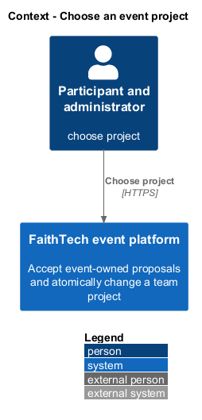
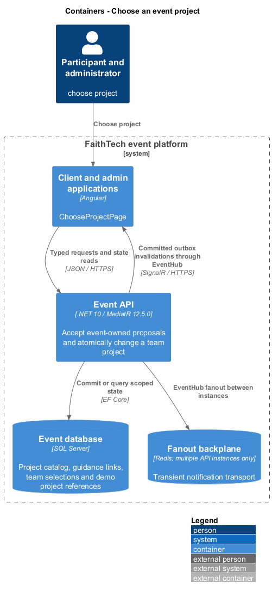
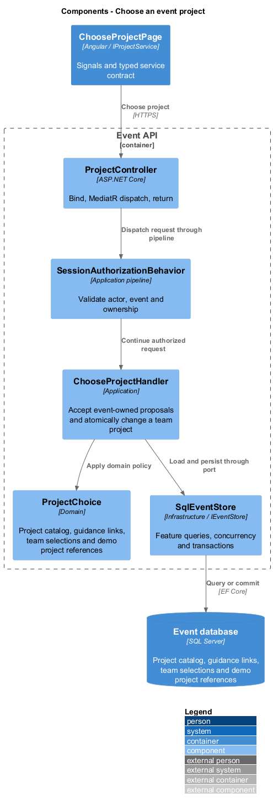
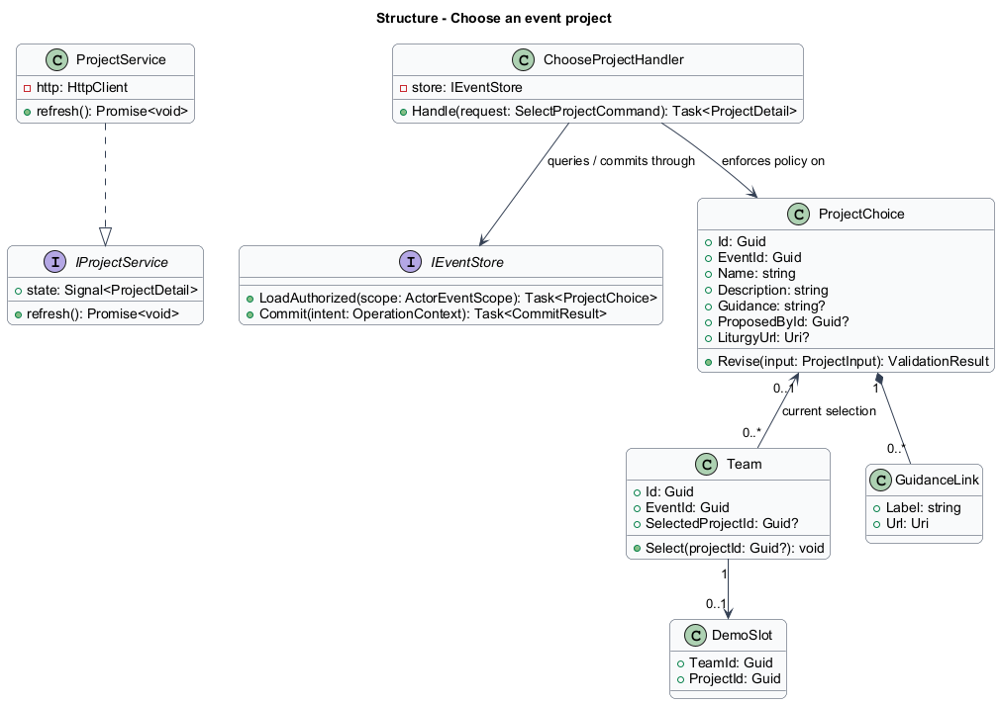
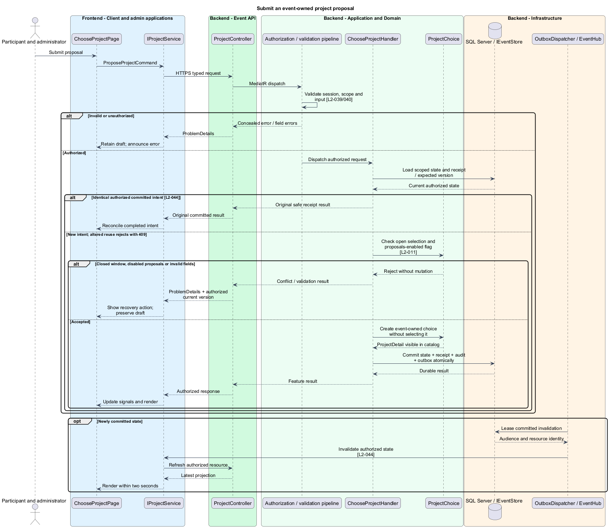
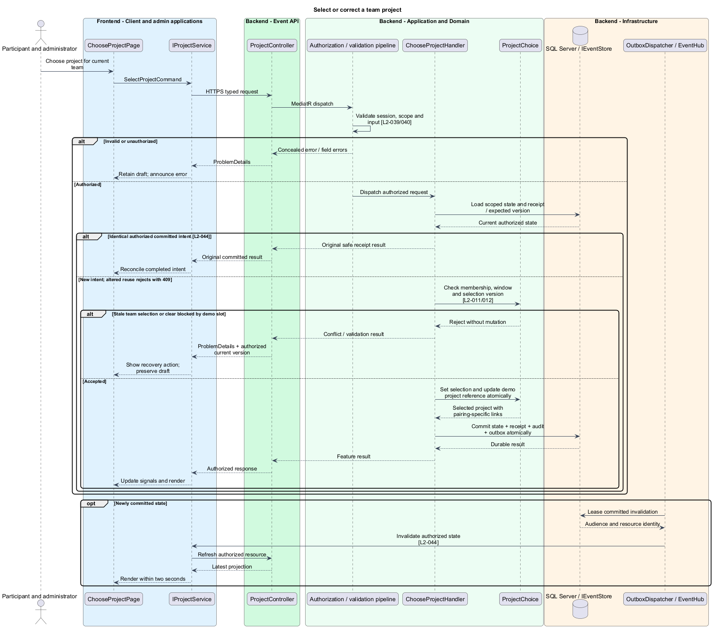
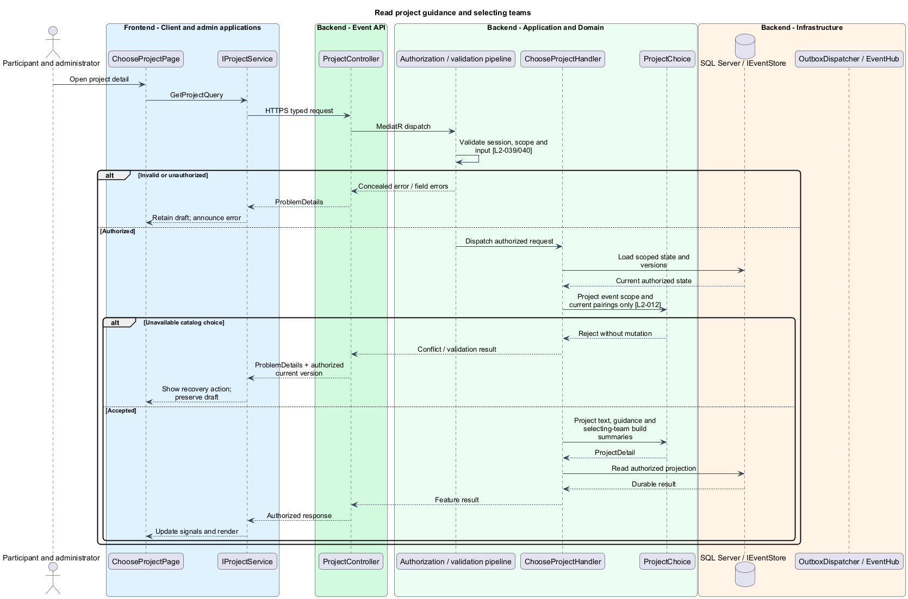

# Choose an event project

## Overview

A project choice is a shared event description that multiple teams may select. A participant proposal immediately becomes an event-owned catalog choice. Selecting a project changes one team's current pairing; it does not move project ownership to the proposer or track development progress.

## Description

This proposed slice follows the [shared architecture contracts](../../README.md). `ChooseProjectPage` owns routing and dialogs; domain components consume `IProjectService` through `PROJECT_SERVICE`. `ProjectService` implements HTTP access in `api`.

`/events/:eventId/projects` lists choices; `/:projectId` presents detail, selecting teams, and each team's current build links. `IProjectService` exposes `list`, `get`, `propose`, `selectForTeam`, and administrator catalog operations. `ProjectDetail` includes ID, text, guidance links, authorized companion action, selecting team summaries, and version.

Participant `POST /api/events/{eventId}/projects` dispatches `ProposeProjectCommand { name, description, guidance, links }`. `PUT /api/events/{eventId}/teams/{teamId}/project` dispatches `SelectProjectCommand { projectId }`. Administrator catalog CRUD uses `/api/admin/events/{eventId}/projects`; administrator team-selection correction uses the corresponding `/teams/{teamId}/project` route and permits null to clear.

`ChooseProjectHandler` accepts proposals only while selection is open and proposals are enabled. Proposing requires no team membership and does not select the result. Accepted proposals immediately appear in the event catalog and become editable only by administrators. Turning new proposals off leaves accepted choices available. Names, descriptions, guidance, and HTTPS tool links follow shared validation and literal-text rendering.

Selection requires an active member of the specified event team and an open selection window. A team has at most one selected project; multiple teams may select the same project. A version check on the team selection makes competing member edits explicit. Administrator corrections remain possible after closure.

The transaction locks the team selection and any demo slot. Changing the project updates that team's demo project reference in the same commit, retaining team, start, and duration. Clearing rejects a referenced demo until its slot is removed. Removing a project rejects any current team selection; removal never silently clears references. Catalog identities and retained build histories are preserved through an inactive/deleted-for-catalog marker rather than cascading historical deletion.

Current build links are read through the exact event/team/project key. A previously unused pairing starts blank; returning to an older pairing restores its retained links. Participant displays expose only each team's current pairing. Guidance remains available during building and recap without implying a progress, approval, or Liturgy gate.

Acceptance checks cover proposals without membership, disabled proposals retaining accepted choices, two teams sharing a choice, simultaneous selections, closed-window corrections, project removal dependencies, and an atomic demo-reference change. Browser tests verify literal guidance, safe external actions, selecting-team context, and preserved drafts after stale saves.

## Requirements

The following verbatim primary excerpts link to their complete normative definitions and Given–When–Then acceptance criteria. Shared constraints apply as specified in the [architecture contracts](../../README.md).

| L2 ID | Refines (L1) | Requirement excerpt |
|---|---|---|
| [L2-011](../../../specs/L2.md#l2-011-project-choices-and-proposals) | `L1-005` | Administrators must configure either predefined-only project selection or a mode also allowing participant proposals. Projects must have a title and description; accepted proposals must immediately become event choices without a separate approval workflow. One project can be selected by multiple teams; each team has at most one selected project. Any team member can select or change its project during selection. |
| [L2-012](../../../specs/L2.md#l2-012-project-details-and-building-guidance) | `L1-005` | Project-selection and project-detail screens must show configured descriptions, selected teams, building guidance, and available repository/demo links. Administrators must customize guidance and tools links without requiring project-management features in this platform. |

## Diagrams

Participant and administrator uses the event platform to choose project. The context isolates this capability from unrelated event activities.

The Client and admin applications calls the API for authoritative state. SQL Server retains project catalog, guidance links, team selections and demo project references; SignalR invalidations prompt authorized reads.

`ProjectController` dispatches through the application pipeline. `ChooseProjectHandler` owns the feature policy and uses the persistence port.

`ProjectChoice` carries stable identity and feature state. The service interface separates Angular consumers from HTTP; `IEventStore` represents the application persistence boundary. Method shapes are slice-specific views of the shared contracts.

Submit an event-owned project proposal applies check open selection and proposals-enabled flag [l2-011]. Closed window, disabled proposals or invalid fields leaves committed state unchanged; the client retains enough context to recover.

Select or correct a team project applies check membership, window and selection version [l2-011/012]. Stale team selection or clear blocked by demo slot leaves committed state unchanged; the client retains enough context to recover.

Read project guidance and selecting teams applies project event scope and current pairings only [l2-012]. Unavailable catalog choice leaves committed state unchanged; the client retains enough context to recover.

